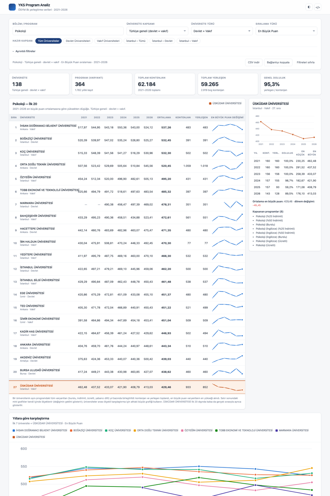

# YKS Program Analiz

[](https://github.com/HakanIST/yks-program-analiz/actions/workflows/pages.yml)
[](https://github.com/HakanIST/yks-program-analiz/actions/workflows/test.yml)
[](LICENSE)

**2021–2026 YKS ilk yerleştirme verileriyle, bölüm/program bazında üniversite karşılaştırma paneli.**
Bir program seçilir, üniversite kapsamı belirlenir, ilk 20 üniversite dönem ortalamasına göre sıralanır;
her üniversitenin yıllık değişimi grafikle izlenir ve takip edilen kurum ilk 20'ye giremese bile **gerçek sırasıyla** ayrıca gösterilir.

🔗 **Canlı panel:** <https://hakanist.github.io/yks-program-analiz/>



---

## İçindekiler

- [Ne yapar?](#ne-yapar)
- [Hızlı başlangıç](#hızlı-başlangıç)
- [Metodoloji](#metodoloji)
- [Veri](#veri)
- [Proje yapısı](#proje-yapısı)
- [Geliştirme](#geliştirme)
- [Kendi kurumunuz için uyarlama](#kendi-kurumunuz-için-uyarlama)
- [Yol haritası](#yol-haritası)
- [Katkı, lisans ve atıf](#katkı-lisans-ve-atıf)

---

## Ne yapar?

| Yetenek | Açıklama |
|---|---|
| **Program seçimi** | 929 temel program adı içinde anlık arama. Burslu/ücretli varyantlar tek program altında toplanır; birden fazla dilde sunulan programlarda **her öğretim dili ayrı madde** olarak da listelenir (`Moleküler Biyoloji ve Genetik (İngilizce)`), çünkü Türkçe ve İngilizce bölümler ayrı bölümlerdir. Liste varsayılan olarak **takip edilen kurumun programlarıyla** sınırlıdır; tek kutucukla tüm programlara genişler. |
| **Dil kırılımı** | Birleşik görünümde birden fazla dil varsa uyarı ve dil bazına geçiş çipleri; detay panelinde yıl × dil kırılım tablosu; tabloda `Türkçe + İngilizce` rozeti; CSV'de öğretim dili sütunu. |
| **Üniversite kapsamı** | Türkiye geneli, İstanbul, tek tek 81 il, KKTC, yurt dışı; devlet / vakıf / tüm türler. Talep edilen altı hazır kapsam tek tıkla seçilebilir. |
| **İlk 20 sıralaması** | Seçilen ölçütün 2021–2026 ortalamasına göre yüksekten düşüğe. Yıllık değerler, ortalama, kontenjan ve yerleşen aynı satırda. |
| **İki ölçüt** | *En Büyük Puan* (ortalama, azalan) ve *Doluluk Oranı* (ortalama azalan, **eşitlikte kontenjanı yüksek olan üstte**). |
| **Yıllık çizgi grafikler** | Her satırın sonunda mini trend grafiği, panelde büyük grafik, altta ilk 7 + takip edilen kurumun karşılaştırma grafiği. Değer arttıkça çizgi yukarı çıkar. |
| **Nokta detayı** | Grafik noktasının üzerine gelince yıl, puan türü, kontenjan, yerleşen, doluluk, en küçük ve en büyük puan görünür. |
| **Takip edilen üniversite** | İlk 20 dışındaysa listenin altında, **21. sıra olarak değil, gerçek sırasıyla** gösterilir (ör. `34 | Üsküdar Üniversitesi`). |
| **Kategori özeti** | Seçili filtrelerdeki üniversite sayısı, program varyantı, toplam kontenjan, toplam yerleşen ve genel doluluk oranı. |
| **Ayrıntılı filtreler** | Yıl, lisans/ön lisans, puan türü, öğretim dili, ücret/burs türü, öğretim şekli. |
| **Paylaşım ve dışa aktarım** | Her görünümün kendi bağlantısı var (URL'de saklanır); tablo tek tıkla CSV olarak indirilir. |
| **Arayüz** | Açık/koyu tema, klavyeyle kullanım, mobil uyum, yazdırma düzeni. Harici JS/CSS bağımlılığı yok. |

---

## Hızlı başlangıç

Panel tamamen istemci tarafında çalışır; sunucu gerekmez.

```bash
git clone https://github.com/HakanIST/yks-program-analiz.git
cd yks-program-analiz
python3 -m http.server 8765 --directory docs
# tarayıcıda: http://localhost:8765
```

Kendi ham verinizden JSON üretmek için:

```bash
python3 -m pip install -r tools/requirements.txt
python3 tools/build_dataset.py --girdi ham-veri.xlsx --ham-yaz
```

---

## Metodoloji

Bu bölüm, sayıların nasıl üretildiğini açıkça tanımlar; farklı bir yöntem tercih edenler için kararların hepsi tek yerde toplanmıştır.

### 1. Program adlarının ayrıştırılması

ÖSYM kılavuzlarında program adı, niteliklerini parantez içinde taşır:

```
"Psikoloji (İngilizce) (%50 İndirimli)"
   ├── temel program : Psikoloji
   ├── öğretim dili  : İngilizce
   ├── ücret/burs    : %50 İndirimli
   └── öğretim şekli : Örgün
```

Ayrıştırılan boyutlar: **dil** (İngilizce, Almanca, Fransızca, Arapça, Rusça, İspanyolca, Türkçe), **ücret** (Burslu, %75/%50/%25 İndirimli, Ücretli, Ücretsiz), **öğretim şekli** (Örgün, İkinci Öğretim, Uzaktan, Açıköğretim).

**Bilerek ayrıştırılmayanlar:** UOLP ortak programları, M.T.O.K., bakanlık adına açılan kontenjanlar, yerleşke ve kontenjan türü etiketleri temel adın parçası olarak kalır — bunlar gerçekten farklı programlardır, tek kalemde toplanmaları yanıltıcı olur.

### 2. Kılavuzlar arası adlandırma farkları

Aynı program, kılavuz yılına göre farklı yazılabiliyor. Düzeltilmezse bir üniversitenin altı yıllık serisi ikiye bölünür — ör. "Diş Hekimliği" hem 2021–2022, hem 2023–2026 kaydı olan iki ayrı program gibi görünür.

| Sorun | Örnek | Çözüm |
|---|---|---|
| 2021–2022'de fakülte/yüksekokul adı, sonrasında yalın program adı | `Tıp Fakültesi`, `Meram Tıp Fakültesi`, `Hemşirelik Yüksekokulu` | Ek atılır; kalan ad veri setindeki yalın adlarla eşleştirilir → `Tıp`, `Hemşirelik` |
| Yerleşke etiketi sonradan kaldırılmış | `Veteriner Fakültesi (Kiraz)` → sonraki yıllarda `Veteriner` | Etiketli karşılığı hiç yoksa etiketsiz ada düşülür |
| Aynı adın farklı yazımı | `UOLP-SUNY Binghamton` ~ `UOLP-Suny Binghamton`, `İlahiyat (M.T.O.K.)` ~ `İlahiyat(M.T.O.K.)` | Büyük/küçük harf ve noktalama yok sayılarak birleştirilir; **en güncel kılavuzun yazımı** gösterilir |

Bu eşleme elle hazırlanmış bir listeye değil, veri setinin kendisine bakarak kurulur (`tools/normalize.py` → `kanonik_program_haritasi`), böylece yeni yıllar eklendiğinde de çalışır. Toplam **76 program adı** birleşti, **1.564 kayıt** etkilendi; program sayısı 1.005'ten **929**'a indi. `Hamidiye Uluslararası Tıp Fakültesi` gibi gerçekten ayrı olan programlar korunur (`Uluslararası Tıp`), çünkü eşleme yalnızca veri setinde karşılığı bulunan adlara yapılır.

### 3. Varyantların yıl bazında birleştirilmesi

Bir üniversitenin aynı programda birden çok varyantı olabilir (Burslu + %50 İndirimli + Ücretli + İngilizce). Yıl bazında birleştirme kuralı:

| Alan | Kural |
|---|---|
| Kontenjan, Yerleşen | Toplanır |
| En Büyük Puan | Varyantların **en yükseği** |
| En Küçük Puan | Varyantların **en düşüğü** |
| Doluluk Oranı | Toplam yerleşen / toplam kontenjan |

> Vakıf üniversitelerinde en büyük puan çoğunlukla burslu kontenjandan gelir. Karşılaştırmayı daraltmak isteyen kullanıcı **Ücret / Burs** filtresinden yalnızca "Burslu" ya da yalnızca "Ücretli" seçebilir; tüm hesaplar filtreye göre yeniden yapılır.

**Öğretim dili bir varyant değil, ayrı bölümdür.** `Moleküler Biyoloji ve Genetik` ile `Moleküler Biyoloji ve Genetik (İngilizce)` YÖK nezdinde iki ayrı bölümdür ve doluluk gibi kurumsal ölçütler bölüm bazında değerlendirilir. Bu yüzden:

- Program listesinde çok dilli programlar için her dil ayrı madde olarak sunulur; yalın ad "tüm diller" (birleşik) anlamındadır ve eski bağlantılarla uyumludur.
- Birleşik görünümde birden fazla dil varsa tablo üstünde uyarı gösterilir; satırda `Türkçe + İngilizce` rozeti bulunur.
- Detay panelindeki kırılım tablosu (`ranking.js` → `dilKirilimi`) aynı birleştirme kurallarını dil boyutunu ayrı tutarak uygular; dil filtreli `hesapla` ile birebir aynı sonucu verir (testlerle doğrulanır).

### 4. Ortalama ve sıralama

- **En Büyük Puan ölçütü:** üniversitenin veri bulunan yıllardaki en büyük puanlarının aritmetik ortalaması, **yüksekten düşüğe**.
- **Doluluk Oranı ölçütü:** yıllık doluluk oranlarının aritmetik ortalaması, **yüksekten düşüğe**; **eşitlikte toplam kontenjanı yüksek olan üst sırada**.
- Program bazı yıllar açılmamışsa o yıl ortalamaya katılmaz (sıfır sayılmaz), grafikte çizgi kırılır.
- Ölçüt için hiç değeri olmayan üniversiteler sıralamaya alınmaz, sıra numarası verilmez.

### 5. Kapsam tanımları

| Kapsam | Tanım |
|---|---|
| Türkiye geneli | Yurt içi devlet + vakıf üniversiteleri (KKTC ve yurt dışı hariç) |
| İstanbul | Şehri İstanbul olan üniversiteler |
| Devlet / Vakıf | Kaynaktaki tür koduna göre; `VAKIF MYO` vakıf grubuna, `KKTC VAKIF` KKTC grubuna dahildir |
| Şehir | Üniversite adındaki parantezli şehirden, yoksa ad içindeki il adından çözülür; çözülemeyen iki kurum `tools/normalize.py` içinde elle eşlenmiştir |

### 6. Grafik yönü

Her iki ölçütte de **değer arttıkça çizgi yukarı çıkar**: en büyük puanın yükselmesi de doluluk oranının artması da grafikte yükseliş olarak görünür.

---

## Veri

### Kaynak

ÖSYM *Yükseköğretim Programları ve Kontenjanları Kılavuzu* ekleri, **ilk yerleştirme** sonuçları, 2021–2026. Alanlar: yıl, lisans/ön lisans, üniversite türü, üniversite, bölüm/program adı, puan türü, kontenjan, yerleşen, doluluk oranı, en küçük puan, en büyük puan.

Ham veri `data/raw/yks-ham.csv.gz` içinde bulunur (gzip'li CSV, ~2,5 MB, 128.832 satır).

> **Kurum içi tablolarla fark:** Kontenjan ve yerleşen sayıları ÖSYM **ilk yerleştirme** kılavuz eklerinden alınır. Ek yerleştirme, kesin kayıt sayıları ve sonradan eklenen ek kontenjanlar (ör. deprem kontenjanı) dahil değildir; Rektörlük/ÖİDB tablolarında burslu kontenjanların 1–2 fazla görünmesi ve doluluk oranlarının ~1–2 puan ayrışması bundandır.

### Üretilen dosyalar

`tools/build_dataset.py`, `docs/data/` altına üç dosya yazar:

| Dosya | İçerik |
|---|---|
| `meta.json` | Sözlükler: yıllar, seviyeler, üniversite türleri, puan türleri, diller, ücretler, öğretim şekilleri, şehirler, üniversiteler, programlar |
| `records.json` | Sütun bazlı (columnar), sözlük indeksli kayıtlar |
| `VERSION.json` | Üretim zamanı, kaynak dosya özeti (SHA-256), kayıt sayısı |

`records.json` sütunları:

| Sütun | Anlam |
|---|---|
| `y` | yıl indeksi · `l` seviye · `t` üniversite türü · `u` üniversite · `p` temel program |
| `d` | öğretim dili · `f` ücret/burs · `e` öğretim şekli · `s` puan türü |
| `k` | kontenjan · `ye` yerleşen |
| `mn`, `mx` | en küçük / en büyük puan × 100.000 (tam sayı; `-1` = veri yok) |

Doluluk oranı `ye / k` ile türetilebildiği için saklanmaz, tarayıcıda hesaplanır. Satır bazlı JSON'da ~25 MB tutan veri bu kodlamayla gzip sonrası ~1,4 MB'a iner; panel veriyi tek istekte indirip tamamen bellekte filtreler.

---

## Proje yapısı

```
├── data/raw/            ham veri (gzip'li CSV) ve kaynak açıklaması
├── docs/                GitHub Pages kökü — panelin tamamı
│   ├── index.html
│   ├── assets/css/app.css
│   ├── assets/js/
│   │   ├── app.js       arayüz kabuğu, filtre durumu, çizim
│   │   ├── data.js      veri yükleme ve indeksleme
│   │   ├── ranking.js   sıralama motoru (saf hesap, DOM bilmez)
│   │   ├── charts.js    SVG çizgi grafikler ve ipuçları
│   │   ├── combobox.js  aranabilir açılır liste
│   │   ├── config.js    kuruma özel ayarlar
│   │   └── format.js    tr-TR biçimlendirme
│   └── data/            üretilen JSON veri seti
└── tools/
    ├── build_dataset.py ham veri → JSON
    ├── normalize.py     program ve üniversite adı ayrıştırma
    └── tests/           Node testleri + pandas ile çapraz doğrulama
```

---

## Geliştirme

```bash
# veri setini yeniden üret
python3 tools/build_dataset.py --girdi data/raw/yks-ham.csv.gz

# beklenen sonuçları pandas ile bağımsız olarak üret
python3 tools/tests/groundtruth.py

# sıralama motorunu test et (27 test)
node tools/tests/ranking.test.mjs
```

Testler iki katmanlıdır: davranış testleri (sıra numaraları, kapsam filtreleri, takip edilen kurumun gerçek sırası, toplamların filtreyle değişmesi) ve **pandas ile çapraz doğrulama** — beş senaryoda ilk 10 sıralaması ve toplamlar, tarayıcıdaki JavaScript hesabı ile bağımsız bir pandas hesabında birebir aynı çıkmalıdır.

Derleme adımı, paket yöneticisi ve çalışma zamanı bağımlılığı yoktur; `docs/` klasörü olduğu gibi yayınlanır.

---

## Kendi kurumunuz için uyarlama

Panel Üsküdar Üniversitesi için hazırlandı, ancak kuruma özel her şey tek dosyada toplandı — `docs/assets/js/config.js`:

```js
export const AYAR = {
  kurumAdi: "Üsküdar Üniversitesi",             // başlıkta ve sekme adında görünen kurum
  vurgulananUniversite: "ÜSKÜDAR ÜNİVERSİTESİ", // ilk 20'ye giremese de gösterilecek kurum
  sadeceKurumProgramlari: true,                 // program listesi açılışta kurumla sınırlı mı
  varsayilanProgram: "Psikoloji",               // açılışta seçili program
  varsayilanKapsam: "ist-vakif",                // açılıştaki kapsam: tumu | devlet | vakif | ist | ist-devlet | ist-vakif
  ilkN: 20,                                     // tabloda gösterilecek üniversite sayısı
  repo: "https://github.com/HakanIST/yks-program-analiz",
  veriDizini: "data",
};
```

Takip edilen üniversite ayrıca arayüzdeki **Ayrıntılı filtreler → Ayrıca gösterilecek üniversite** alanından da değiştirilebilir; seçim paylaşılabilir bağlantıya işlenir.

---

## Yol haritası

- [ ] Program bazında ülke geneli özet sayfası (yıllara göre kontenjan ve doluluk eğilimleri)
- [ ] İki üniversitenin yan yana karşılaştırılması
- [ ] Ek yerleştirme verilerinin ayrı bir katman olarak eklenmesi
- [ ] Tabloyu PNG olarak dışa aktarma
- [ ] Panel arayüzünün İngilizce çevirisi

---

## Katkı, lisans ve atıf

Katkı süreci için [CONTRIBUTING.md](CONTRIBUTING.md), davranış kuralları için [CODE_OF_CONDUCT.md](CODE_OF_CONDUCT.md) dosyalarına bakın. Veri hatası bildirimleri için ayrı bir konu şablonu vardır.

Kod **MIT Lisansı** ile yayımlanır (bkz. [LICENSE](LICENSE)). Ham veri ÖSYM tarafından kamuya açık olarak yayımlanan kılavuz eklerinden derlenmiştir; veriye ilişkin haklar kaynağına aittir.

> **Sorumluluk reddi:** Bu bağımsız bir açık kaynak çalışmasıdır; ÖSYM ile ilişkisi ya da resmî bir bağı yoktur. Sayılar kaynak kılavuzlardan derlenmiştir, tercih kararlarında resmî ÖSYM belgeleri esas alınmalıdır.

Atıf:

```
YKS Program Analiz (2026). Üsküdar Üniversitesi.
https://github.com/HakanIST/yks-program-analiz
```

---

## English summary

**YKS Program Analiz** is a static, dependency-free web panel that compares Turkish universities by academic program using the official ÖSYM placement data for 2021–2026 (128,832 records, 239 universities, 929 base programs).

Pick a program, choose a scope (nationwide, İstanbul, a single province, state/foundation universities), and the panel ranks the top 20 universities by the six-year average of either the **highest admission score** or the **fill rate** (ties broken by quota). Each row carries a sparkline of its yearly trend, points expose full detail on hover, and a configurable "tracked university" is always shown with its **true rank** even when it falls outside the top 20.

The data pipeline (`tools/build_dataset.py`) turns the source spreadsheet into dictionary-encoded columnar JSON (~1.4 MB gzipped), which the browser loads once and filters entirely in memory. The ranking engine is covered by Node tests, five of which cross-check the JavaScript results against an independent pandas implementation.

Everything institution-specific lives in `docs/assets/js/config.js` — change three lines to run the panel for another university. MIT licensed.
